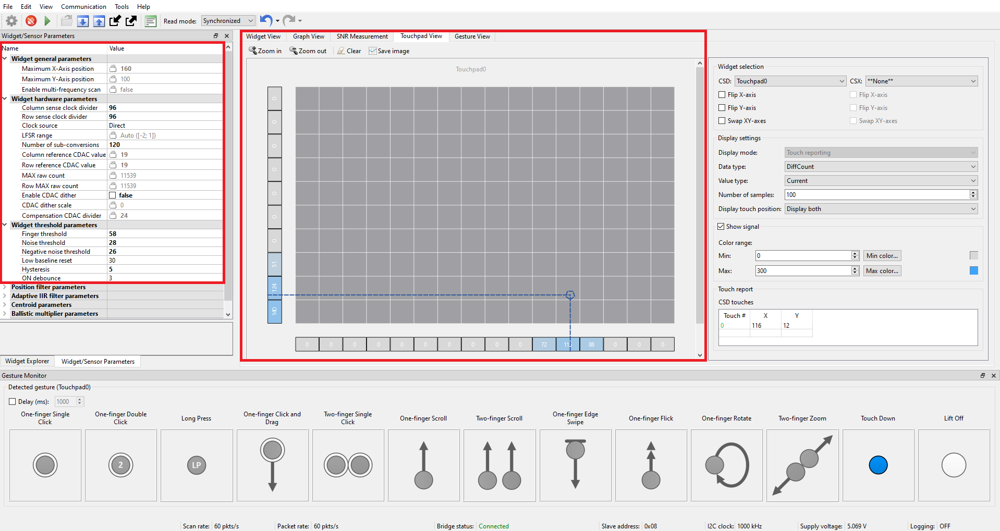

# PSoC&trade; 4: MSC CAPSENSE&trade; Liquid tolerant touchpad

This code example demonstrates how to use the CAPSENSE&trade; middleware to detect a finger touch position with gestures on a self-capacitance-based touchpad widget in PSoC&trade; 4 devices with multi sense converter (MSC).


[View this README on GitHub.](https://github.com/Infineon/mtb-example-psoc4-msc-capsense-liquid-tolerant-touchpad)

[Provide feedback on this code example.](https://cypress.co1.qualtrics.com/jfe/form/SV_1NTns53sK2yiljn?Q_EED=eyJVbmlxdWUgRG9jIElkIjoiQ0UyMzgwMzkiLCJTcGVjIE51bWJlciI6IjAwMi0zODAzOSIsIkRvYyBUaXRsZSI6IlBTb0MmdHJhZGU7IDQ6IE1TQyBDQVBTRU5TRSZ0cmFkZTsgTGlxdWlkIHRvbGVyYW50IHRvdWNocGFkIiwicmlkIjoicmFqYW5uYWdhdXRhIiwiRG9jIHZlcnNpb24iOiIxLjAuMCIsIkRvYyBMYW5ndWFnZSI6IkVuZ2xpc2giLCJEb2MgRGl2aXNpb24iOiJNQ0QiLCJEb2MgQlUiOiJJQ1ciLCJEb2MgRmFtaWx5IjoiUFNPQyJ9)

## Requirements

- [ModusToolbox&trade;](https://www.infineon.com/modustoolbox) v3.1 or later (tested with v3.1)
- Board support package (BSP) minimum required version: 3.1.0
- Programming language: C
- Associated parts: [PSoC&trade; 4100S Max](https://www.infineon.com/cms/en/product/evaluation-boards/cy8ckit-041s-max/) 

## Supported toolchains (make variable 'TOOLCHAIN')

- GNU Arm&reg; Embedded Compiler v11.3.1 (`GCC_ARM`) - Default value of `TOOLCHAIN`
- Arm&reg; Compiler v6.16 (`ARM`)
- IAR C/C++ Compiler v9.30.1 (`IAR`)

## Supported kits (make variable 'TARGET')

- [PSoC&trade; 4100S Max Pioneer Kit](https://www.infineon.com/CY8CKIT-041S-MAX) (`CY8CKIT-041S-MAX`) – Default value of `TARGET`

## Hardware setup

This example uses the board's default configuration. See the [kit user guide](https://www.infineon.com/dgdl/Infineon-CY8CKIT-041S-MAX_PSoC_4100S_Max_Pioneer_Kit_Guide-UserManual-v01_00-EN.pdf?fileId=8ac78c8c7d710014017d71538d1f209d) to ensure that the board is configured correctly.

Please follow the **CY8CKIT-041S-MAX Kit rework** section as mentioned in the [kit user guide](https://www.infineon.com/dgdl/Infineon-CY8CKIT-041S-MAX_PSoC_4100S_Max_Pioneer_Kit_Guide-UserManual-v01_00-EN.pdf?fileId=8ac78c8c7d710014017d71538d1f209d) to provide performance improvement for CSD (self-capacitance) sensing.

**Note:** The PSoC&trade; 4 kits ship with KitProg2 installed. ModusToolbox&trade; requires KitProg3. Before using this code example, make sure that the board is upgraded to KitProg3. The tool and instructions are available in the [Firmware Loader](https://github.com/Infineon/Firmware-loader) GitHub repository. If you do not upgrade, you will see an error like "unable to find CMSIS-DAP device" or "KitProg firmware is out of date".

## Software setup

This example requires no additional software or tools.

## Using the code example

Create the project and open it using one of the following:

<details><summary><b>In Eclipse IDE for ModusToolbox&trade;</b></summary>

1. Click the **New Application** link in the **Quick Panel** (or, use **File** > **New** > **ModusToolbox&trade; Application**). This launches the [Project Creator](https://www.infineon.com/ModusToolboxProjectCreator) tool.

2. Pick a kit supported by the code example from the list shown in the **Project Creator – Choose Board Support Package (BSP)** dialog.

   When you select a supported kit, the example is reconfigured automatically to work with the kit. To work with a different supported kit later, use the [Library Manager](https://www.infineon.com/ModusToolboxLibraryManager) to choose the BSP for the supported kit. You can use the Library Manager to select or update the BSP and firmware libraries used in this application. To access the Library Manager, click the link from the **Quick Panel**.

   You can also just start the application creation process again and select a different kit.

   If you want to use the application for a kit not listed here, you may need to update the source files. If the kit does not have the required resources, the application may not work.

3. In the **Project Creator - Select Application** dialog, choose the example by enabling the checkbox.

4. (Optional) Change the suggested **New Application Name**.

5. The **Application(s) Root Path** defaults to the Eclipse workspace which is usually the desired location for the application. If you want to store the application in a different location, you can change the *Application(s) Root Path* value. Applications that share libraries must be in the same root path.

6. Click **Create** to complete the application creation process.

For more details, see the [Eclipse IDE for ModusToolbox&trade; user guide](https://www.infineon.com/MTBEclipseIDEUserGuide) (locally available at *{ModusToolbox&trade; install directory}/docs_{version}/mt_ide_user_guide.pdf*).

</details>

<details><summary><b>In command-line interface (CLI)</b></summary>

ModusToolbox&trade; provides the Project Creator as both a GUI tool and the command-line tool (*project-creator-cli*). The CLI tool can be used to create applications from a CLI terminal or from within batch files or shell scripts. This tool is available in the *{ModusToolbox&trade; install directory}/tools_{version}/project-creator/* directory.

Use a CLI terminal to invoke the "project-creator-cli" tool. On Windows, use the command-line "modus-shell" program provided in the ModusToolbox&trade; installation instead of a standard Windows command-line application. This shell provides access to all ModusToolbox&trade; tools. You can access it by typing `modus-shell` in the search box in the Windows menu. In Linux and macOS, you can use any terminal application.

The "project-creator-cli" tool has the following arguments:

Argument | Description | Required/optional
---------|-------------|-----------
`--board-id` | Defined in the `<id>` field of the [BSP](https://github.com/Infineon?q=bsp-manifest&type=&language=&sort=) manifest | Required
`--app-id`   | Defined in the `<id>` field of the [CE](https://github.com/Infineon?q=ce-manifest&type=&language=&sort=) manifest | Required
`--target-dir`| Specify the directory in which the application is to be created if you prefer not to use the default current working directory | Optional
`--user-app-name`| Specify the name of the application if you prefer to have a name other than the example's default name | Optional

<br>

The following example clones the "[MSCcapsenseliquidtoleranttouchpad](https://github.com/Infineon/mtb-example-psoc4-msc-capsense-liquid-tolerant-touchpad)" application with the desired name "MSCcapsenseliquidtoleranttouchpad" configured for the [CY8CKIT-041S-MAX](https://www.infineon.com/CY8CKIT-041S-MAX) BSP into the specified working directory, *C:/mtb_projects*:

   ```
   project-creator-cli --board-id CY8CKIT-041S-MAX --app-id mtb-example-psoc4-msc-capsense-liquid-tolerant-touchpad --user-app-name MSCcapsenseliquidtoleranttouchpad --target-dir "C:/mtb_projects"
   ```

> **Note:** The project-creator-cli tool uses the `git clone` and `make getlibs` commands to fetch the repository and import the required libraries. For details, see the "Project creator tools" section of the [ModusToolbox&trade; user guide](https://www.infineon.com/ModusToolboxUserGuide) (locally available at *{ModusToolbox&trade; install directory}/docs_{version}/mtb_user_guide.pdf*).

To work with a different supported kit later, use the [Library Manager](https://www.infineon.com/ModusToolboxLibraryManager) to choose the BSP for the supported kit. You can invoke the Library Manager GUI tool from the terminal by using the `make library-manager` command or use the Library Manager CLI tool (library-manager-cli) to change the BSP.

The "library-manager-cli" tool has the following arguments:

Argument | Description | Required/optional
---------|-------------|-----------
`--add-bsp-name` | Name of the BSP that should be added to the application | Required
`--set-active-bsp` | Name of the BSP that should be as active BSP for the application | Required
`--add-bsp-version`| Specify the version of the BSP that should be added to the application if you do not wish to use the latest from manifest | Optional
`--add-bsp-location`| Specify the location of the BSP (local/shared) if you prefer to add the BSP in a shared path | Optional

<br>

The following example adds the [CY8CKIT-041S-MAX](https://www.infineon.com/CY8CKIT-041S-MAX) BSP to the already created application and makes it the active BSP for the application:

   ```
   library-manager-cli --project "C:/mtb_projects/mtb-example-psoc4-msc-capsense-liquid-tolerant-touchpad" --add-bsp-name CY8CKIT-041S-MAX --add-bsp-version "latest-v3.X" --add-bsp-location "local"

   library-manager-cli --project "C:/mtb_projects/mtb-example-psoc4-msc-capsense-liquid-tolerant-touchpad" --set-active-bsp APP_CY8CKIT-041S-MAX
   ```

</details>

<details><summary><b>In third-party IDEs</b></summary>

Use one of the following options:

- **Use the standalone [Project Creator](https://www.infineon.com/ModusToolboxProjectCreator) tool:**

   1. Launch Project Creator from the Windows Start menu or from *{ModusToolbox&trade; install directory}/tools_{version}/project-creator/project-creator.exe*.

   2. In the initial **Choose Board Support Package** screen, select the BSP, and click **Next**.

   3. In the **Select Application** screen, select the appropriate IDE from the **Target IDE** drop-down menu.

   4. Click **Create** and follow the instructions printed in the bottom pane to import or open the exported project in the respective IDE.

<br>

- **Use command-line interface (CLI):**

   1. Follow the instructions from the **In command-line interface (CLI)** section to create the application.

   2. Export the application to a supported IDE using the `make <ide>` command.

   3. Follow the instructions displayed in the terminal to create or import the application as an IDE project.

For a list of supported IDEs and more details, see the "Exporting to IDEs" section of the [ModusToolbox&trade; user guide](https://www.infineon.com/ModusToolboxUserGuide) (locally available at *{ModusToolbox&trade; install directory}/docs_{version}/mtb_user_guide.pdf*).

</details>

## Operation

1. Connect the FFC cable between J9 on the PSoC™ 4100S Max Pioneer Board and J2 on the capacitive sensing expansion board. Connect a USB 2.0 Type-A to Micro-B cable on J8 (USB Micro-B connector) as shown in Figure 1 to power the device.

    **Figure 1. Connecting the [CY8CKIT-041S-MAX](https://www.infineon.com/CY8CKIT-041S-MAX) kit with a capacitive sensing expansion board to a PC**
    
       

2. Program the board using one of the following:

   <details><summary><b>Using Eclipse IDE for ModusToolbox&trade;</b></summary>

      1. Select the application project in the Project Explorer.

      2. In the **Quick Panel**, scroll down, and click **\<Application Name> Program (KitProg3_MiniProg4)**.
   </details>

   <details><summary><b>Using CLI</b></summary>

     From the terminal, execute the `make program` command to build and program the application using the default toolchain to the default target. The default toolchain is specified in the application's Makefile, but you can override this value manually:
      ```
      make program TARGET=<BSP> TOOLCHAIN=<toolchain>
      ```

      Example:
      ```
      make program TARGET=CY8CKIT-041S-MAX TOOLCHAIN=GCC_ARM
      ```
   </details>

3.  To test the application, tap your finger once over the CAPSENSE&trade; Touchpad and confirm that the LED1 turns ON; tap it again and confirm that the LED1 turns OFF. 
           
4. Scroll your finger slowly Up, Down, Right, and Left on the touchpad and confirm that the LED1 changes brightness.

5. Flick your finger across the touchpad Up, Down, Right, and Left, and confirm that the LED1 changes brightness.
 
6.  Tap the touchpad once with two fingers and confirm that the LED3 turns ON; tap it again and confirm that the LED3 turns OFF. 

7. Perform a two-finger zoom-in and zoom-out to confirm that LED1 changes brightness. 

8.  Use a water dropper to place water droplets on top of the touchpad. Observe that all LEDs are in OFF state, indicating that no false trigger occurs due to the presence of water.

9. Repeat the steps from 3 to 7 and observe the corresponding LEDs functionality in the presence of water.

10. Open a terminal program and select the KitProg3 COM port. Set the serial port parameters to 8N1 and 115200 baud.

    **Figure 2. UART - Peripheral settings**
    
    

    **Figure 3. Sample output as displayed on Tera Term**
    
    
   
    **Figure 4. Capsense tuner sample output**
    
    

8. You can also monitor the CAPSENSE&trade; data using the CAPSENSE&trade; tuner application as follows:

     **Monitor data using CAPSENSE&trade; tuner**

    1. Open CAPSENSE&trade; tuner from the **Tools** section in the IDE **Quick Panel**. 
    
        You can also run the CAPSENSE&trade; tuner application standalone from the *{ModusToolbox&trade; install directory}/ModusToolbox/tools_{version}/capsense-configurator/capsense-tuner*. In this case, after opening the application, select **File** > **Open** and open the *design.cycapsense* file of the respective application, which is present in the *{Application root directory}/COMPONENT_CUSTOM_DESIGN_MODUS/TARGET_\<BSP-NAME>* folder. 

	     See the [ModusToolbox&trade; user guide](https://www.infineon.com/dgdl/Infineon-ModusToolbox_3.1_a_Tools_Package_User_Guide-GettingStarted-v01_00-EN.pdf?fileId=8ac78c8c88704c7a0188a14ed50b4e45&redirId=188343) (locally available at *{ModusToolbox&trade; install directory}/docs_{version}/mtb_user_guide.pdf*) for options to open the CAPSENSE&trade; tuner application using the CLI.

    2. Ensure the kit is in CMSIS-DAP bulk mode (KitProg3 Status LED is ON and not blinking). See [Firmware Loader](https://github.com/Infineon/Firmware-loader) to learn how to update the firmware and switch modes in KitProg3.
  
    3. In the tuner application, click on the **Tuner Communication Setup** icon or select **Tools** > **Tuner Communication Setup**. In the window that appears, select the I2C checkbox under KitProg3 and configure it as follows: 

       - **I2C address: 8**
       - **Sub-address: 2-Bytes**
       - **Speed (kHz): 1000**

        These are the same values set in the EZI2C resource.

        **Figure 5. Tuner communication setup parameters**

        

    4. Click **Connect** or select **Communication** > **Connect** to establish a connection.
    
        **Figure 6. Tuner Communication Setup parameters**

        

    5. Click **Start** or select **Communication** > **Start** to start data streaming from the device. 
   
       The tuner displays the data from the sensor in the **Widget View**, **Graph View**, and **Touchpad View** tabs.
       
        **Figure 7. Start tuner communication**

        

    6. Set the **Read Mode** to Synchronized mode. Under the **Widget View** tab, you can see the touchpad widget highlighted in blue color when you touch it. 

        **Figure 8. Widget View tab of CAPSENSE&trade; Tuner**

        

    7. You can view the raw count, baseline, difference count, and status for each sensor, as well as the touchpad position, in the **Graph View** tab. For example, to view the sensor data for touchpad 0, select **Touchpad0_Col0** under **Touchpad0**.

        **Figure 9. Widget View tab of CAPSENSE&trade; Tuner**

        

    8. The **Touchpad View** tab shows the heatmap view, and the finger movement can be visualised on the same.

        **Figure 10. Graph View of CAPSENSE&trade; Tuner**

       

    9. See the **Widget/Sensor Parameters** section in the CAPSENSE&trade; tuner window. The compensation CDAC values for each touchpad sensor element calculated by the CAPSENSE&trade; resource are displayed as shown in **Figure 10**. 
      
   10. Ensure that the SNR is greater than 5:1.
   
     Non-reporting of false touches and the linearity of the position graph indicate proper tuning.
   
   **Note:** The touchpad performance can be further enhanced by configuring the board to connect the hatch pattern to shield. To do so, see the kit user guide for the board connection settings. Enable the shield signals in the CAPSENSE&trade; Configurator as shown in **Figure 11**. Then, follow the tuning process explained in [Tuning procedure](https://github.com/Infineon/mtb-example-psoc4-msc-capsense-csd-touchpad-tuning/tree/master#tuning-procedure) to retune the touchpad.

    **Figure 11. Enabling shield signals in CAPSENSE&trade; configurator**

    
    
    

**Note:** When Flip Y axis option is enabled in the CapSense tuner in the widget selection section, the TouchpadView/GestureView window shows opposite gesture detection. This behaviour will be fixed in future release.

## Debugging

You can debug the example to step through the code. In the IDE, use the **\<Application Name> Debug (KitProg3_MiniProg4)** configuration in the **Quick Panel**. For details, see the "Program and debug" section in the [Eclipse IDE for ModusToolbox&trade; user guide](https://www.infineon.com/MTBEclipseIDEUserGuide).

**Note:** By default, the debug port is disabled in the kit to achieve low power. If debugging is required, do the following:
1. Enable the **Debug Mode** under the **Systems** tab in the **Device Configurator** and change the **Debug Mode** setting to **SWD**.
2. Select the pins P3[2] (SWDIO) and P3[3] (SWDCK) under the **SWD pin** setting.
3. Select the Drive mode of both the pins as "Strong Drive,Input buffer on" under the **Pins** tab in the **Device Configurator**.

## Design and implementation

The project contains one proximity widget and one touchpad widget configured in CSD sensing mode. To demonstrate the gesture functionality of the touchpad, PSoC&trade; 4 controls LEDs, whose brightness is controlled based on the position detected on the touchpad and turned ON and OFF based on the detected gestures. Alternatively, the CAPSENSE&trade; software tuner can be used for real-time tuning and monitoring of detected gestures.

The project uses the [CAPSENSE&trade; middleware](https://github.com/Infineon/capsense) (see ModusToolbox&trade; user guide for more details on selecting a middleware). See [AN85951 - PSoC&trade; 4 and PSoC&trade; 6 MCU CAPSENSE&trade; design guide](https://www.infineon.com/AN85951) for more details on CAPSENSE&trade; features and usage.

The [ModusToolbox&trade; software](https://www.infineon.com/ModusToolbox) provides a GUI-based tuner application for debugging and tuning the CAPSENSE&trade; system. The *CAPSENSE&trade; tuner* application works with EZI2C and UART communication interfaces. This project has an SCB block configured in EZI2C mode to establish communication with the on-board KitProg, which in turn enables reading the CAPSENSE&trade; raw data by the CAPSENSE&trade; tuner. See [EZI2C - Peripheral settings](#resources-and-settings).

The CAPSENSE&trade; data structure that contains the CAPSENSE&trade; raw data is exposed to the CAPSENSE&trade; tuner by setting up the I2C communication data buffer with the CAPSENSE&trade; data structure. This enables the tuner to access the CAPSENSE&trade; raw data for tuning and debugging CAPSENSE&trade;.

The WDT in PSoC&trade; 4 is a 16-bit timer and uses the internal low-speed oscillator (ILO) clock of 40 kHz as a source. The accuracy of ILO is (- 50% to +100%). Therefore, the match value of WDT is set after compensating the ILO with IMO. The firmware flow is as follows:

1. Enable the ILO, which is the source for the WDT. Start ILO measurement and get the value of `ilo_compensated_counts` which must be set after every interrupt match.
2. Write the match value. The WDT can generate an interrupt when the WDT counter reaches the match count. The match count is generated using `DESIRED_WDT_INTERVAL_MS`.
3. Enable interrupt generation and assign the interrupt service routine(`wdt_isr`).
4. Enable the WDT. Because the ILO has low accuracy, the `ilo_compensated_counts` are calculated, and the match value of the WDT is updated following a WDT interrupt.
5. The System is put into Deep Sleep in idle mode to save power. Because the watchdog timer works on a low-frequency clock (LFCLK), its operation will not be affected when the system is put into Deep Sleep mode. The watchdog timer interrupt will wake the device from Deep Sleep mode.

### Set up the VDDA supply voltage and Debug mode in the Device Configurator
1. Open the Device Configurator from the **Quick Panel**.
2. Navigate to the **System** tab. Select the **Power** resource, and set the VDDA value under **Operating conditions**.
3. By default, SWD pins are active in all device power modes. Disable Debug mode to disable SWD pins and thereby reduce power consumption as follows:

   **Figure 12. Disable Debug mode in the System tab of Device Configurator**
   
   

### Resources and settings

**Figure 13. EZI2C - Peripheral settings**


The following ModusToolbox&trade; resources are used in this example:

**Table 1. Application resources**

 Resource  |  Alias/object     |    Purpose     |
 :------- | :------------    | :------------ |
 CAPSENSE&trade; | CYBSP_MSC0,CYBSP_MSC1 | CAPSENSE&trade; driver to interact with the MSC hardware and interface the CAPSENSE&trade; sensors 
 SCB (I2C) (PDL) |  CYBSP_EZI2C | EZI2C driver to interface with CAPSENSE&trade; tuner
 PWM(TCPWM) | pwm2 | Controls the duty cycle/Generates a signal at a particular frequency based on the period and compares values 
 UART(PDL) | scb_1 | Send to and receive data from the UART terminal
 LED (BSP) | CYBSP_USER_LED | User LED to show the output
 WDT (PDL) |-| WDT driver to configure the hardware resource |

<br>

## Related resources

Resources  | Links
-----------|----------------------------------
Application notes  | [AN79953](https://www.infineon.com/AN79953) – Getting started with PSoC&trade; 4
Code examples  | [Using ModusToolbox&trade;](https://github.com/Infineon/Code-Examples-for-ModusToolbox-Software) on GitHub
Device documentation | [PSoC&trade; 4 datasheets](https://www.infineon.com/cms/en/search.html#!view=downloads&term=psoc4&doc_group=Data%20Sheet) <br>[PSoC&trade; 4 technical reference manuals](https://www.infineon.com/cms/en/search.html#!view=downloads&term=psoc4&doc_group=Additional%20Technical%20Information)
Development kits | Select your kits from the [Evaluation board finder](https://www.infineon.com/cms/en/design-support/finder-selection-tools/product-finder/evaluation-board).
Libraries on GitHub | [mtb-pdl-cat2](https://github.com/Infineon/mtb-pdl-cat2) – PSoC&trade; 4 Peripheral Driver Library (PDL)<br> [mtb-hal-cat2](https://github.com/Infineon/mtb-hal-cat2) – Hardware Abstraction Layer (HAL) library
Tools  | [ModusToolbox&trade;](https://www.infineon.com/modustoolbox) – ModusToolbox&trade; is a collection of easy-to-use software and tools enabling rapid development with Infineon MCUs, covering applications from embedded sense and control to wireless and cloud-connected systems using AIROC&trade; Wi-Fi and Bluetooth&reg; connectivity devices.

<br>


## Other resources

Infineon provides a wealth of data at www.infineon.com to help you select the right device, and quickly and effectively integrate it into your design.

## Document history

Document title: *CE238039* – *PSoC&trade; 4: MSC CAPSENSE&trade; Liquid tolerant touchpad*

 Version | Description of change
 ------- | ---------------------
 1.0.0   | New code example

<br>

---------------------------------------------------------

© Cypress Semiconductor Corporation, 2023. This document is the property of Cypress Semiconductor Corporation, an Infineon Technologies company, and its affiliates ("Cypress").  This document, including any software or firmware included or referenced in this document ("Software"), is owned by Cypress under the intellectual property laws and treaties of the United States and other countries worldwide.  Cypress reserves all rights under such laws and treaties and does not, except as specifically stated in this paragraph, grant any license under its patents, copyrights, trademarks, or other intellectual property rights.  If the Software is not accompanied by a license agreement and you do not otherwise have a written agreement with Cypress governing the use of the Software, then Cypress hereby grants you a personal, non-exclusive, nontransferable license (without the right to sublicense) (1) under its copyright rights in the Software (a) for Software provided in source code form, to modify and reproduce the Software solely for use with Cypress hardware products, only internally within your organization, and (b) to distribute the Software in binary code form externally to end users (either directly or indirectly through resellers and distributors), solely for use on Cypress hardware product units, and (2) under those claims of Cypress’s patents that are infringed by the Software (as provided by Cypress, unmodified) to make, use, distribute, and import the Software solely for use with Cypress hardware products.  Any other use, reproduction, modification, translation, or compilation of the Software is prohibited.
<br>
TO THE EXTENT PERMITTED BY APPLICABLE LAW, CYPRESS MAKES NO WARRANTY OF ANY KIND, EXPRESS OR IMPLIED, WITH REGARD TO THIS DOCUMENT OR ANY SOFTWARE OR ACCOMPANYING HARDWARE, INCLUDING, BUT NOT LIMITED TO, THE IMPLIED WARRANTIES OF MERCHANTABILITY AND FITNESS FOR A PARTICULAR PURPOSE.  No computing device can be absolutely secure.  Therefore, despite security measures implemented in Cypress hardware or software products, Cypress shall have no liability arising out of any security breach, such as unauthorized access to or use of a Cypress product. CYPRESS DOES NOT REPRESENT, WARRANT, OR GUARANTEE THAT CYPRESS PRODUCTS, OR SYSTEMS CREATED USING CYPRESS PRODUCTS, WILL BE FREE FROM CORRUPTION, ATTACK, VIRUSES, INTERFERENCE, HACKING, DATA LOSS OR THEFT, OR OTHER SECURITY INTRUSION (collectively, "Security Breach").  Cypress disclaims any liability relating to any Security Breach, and you shall and hereby do release Cypress from any claim, damage, or other liability arising from any Security Breach.  In addition, the products described in these materials may contain design defects or errors known as errata which may cause the product to deviate from published specifications. To the extent permitted by applicable law, Cypress reserves the right to make changes to this document without further notice. Cypress does not assume any liability arising out of the application or use of any product or circuit described in this document. Any information provided in this document, including any sample design information or programming code, is provided only for reference purposes.  It is the responsibility of the user of this document to properly design, program, and test the functionality and safety of any application made of this information and any resulting product.  "High-Risk Device" means any device or system whose failure could cause personal injury, death, or property damage.  Examples of High-Risk Devices are weapons, nuclear installations, surgical implants, and other medical devices.  "Critical Component" means any component of a High-Risk Device whose failure to perform can be reasonably expected to cause, directly or indirectly, the failure of the High-Risk Device, or to affect its safety or effectiveness.  Cypress is not liable, in whole or in part, and you shall and hereby do release Cypress from any claim, damage, or other liability arising from any use of a Cypress product as a Critical Component in a High-Risk Device. You shall indemnify and hold Cypress, including its affiliates, and its directors, officers, employees, agents, distributors, and assigns harmless from and against all claims, costs, damages, and expenses, arising out of any claim, including claims for product liability, personal injury or death, or property damage arising from any use of a Cypress product as a Critical Component in a High-Risk Device. Cypress products are not intended or authorized for use as a Critical Component in any High-Risk Device except to the limited extent that (i) Cypress’s published data sheet for the product explicitly states Cypress has qualified the product for use in a specific High-Risk Device, or (ii) Cypress has given you advance written authorization to use the product as a Critical Component in the specific High-Risk Device and you have signed a separate indemnification agreement.
<br>
Cypress, the Cypress logo, and combinations thereof, WICED, ModusToolbox, PSoC, CapSense, EZ-USB, F-RAM, and Traveo are trademarks or registered trademarks of Cypress or a subsidiary of Cypress in the United States or in other countries. For a more complete list of Cypress trademarks, visit www.infineon.com. Other names and brands may be claimed as property of their respective owners.
